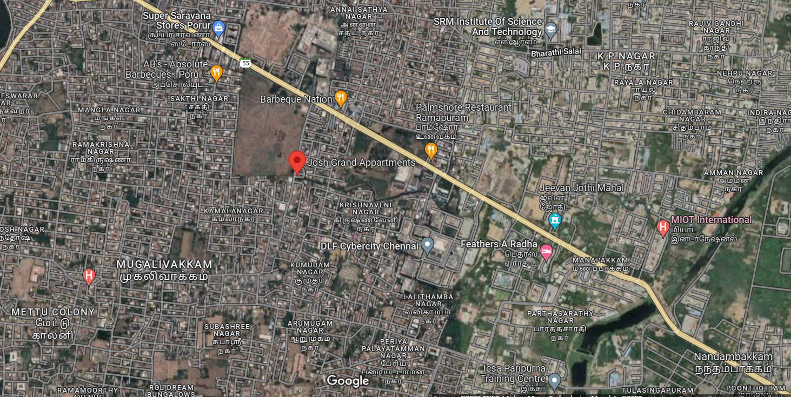
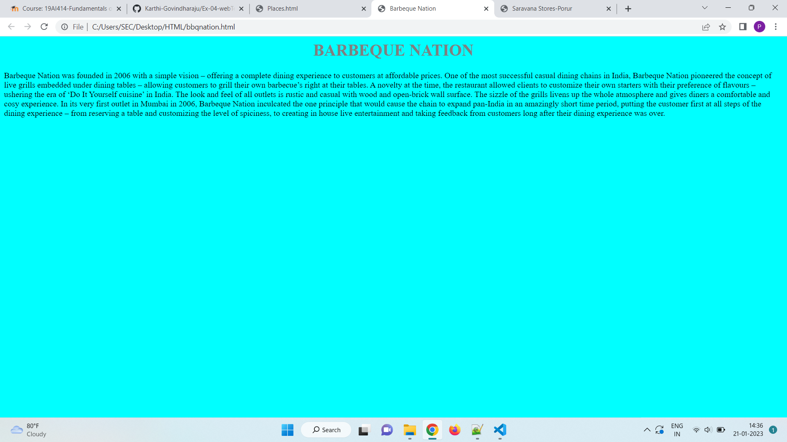
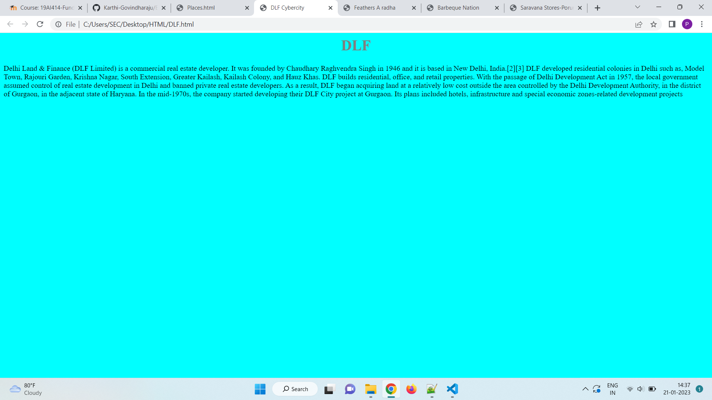
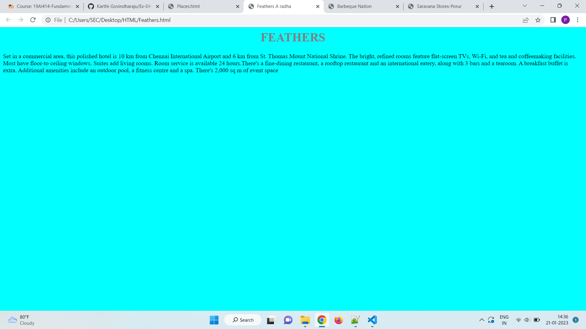
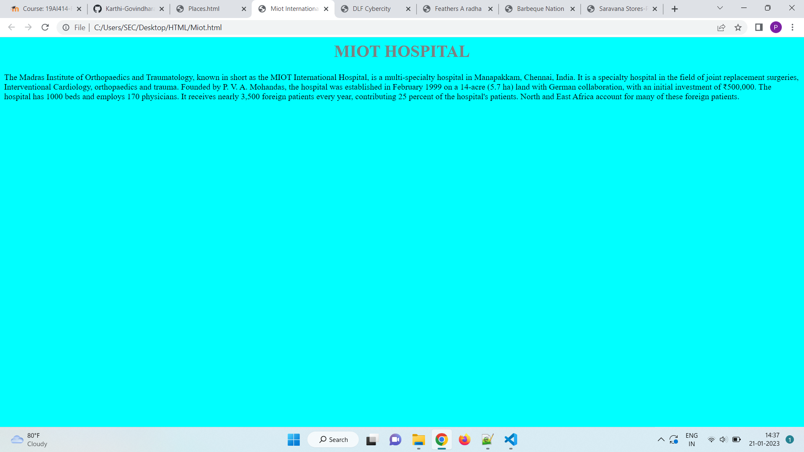
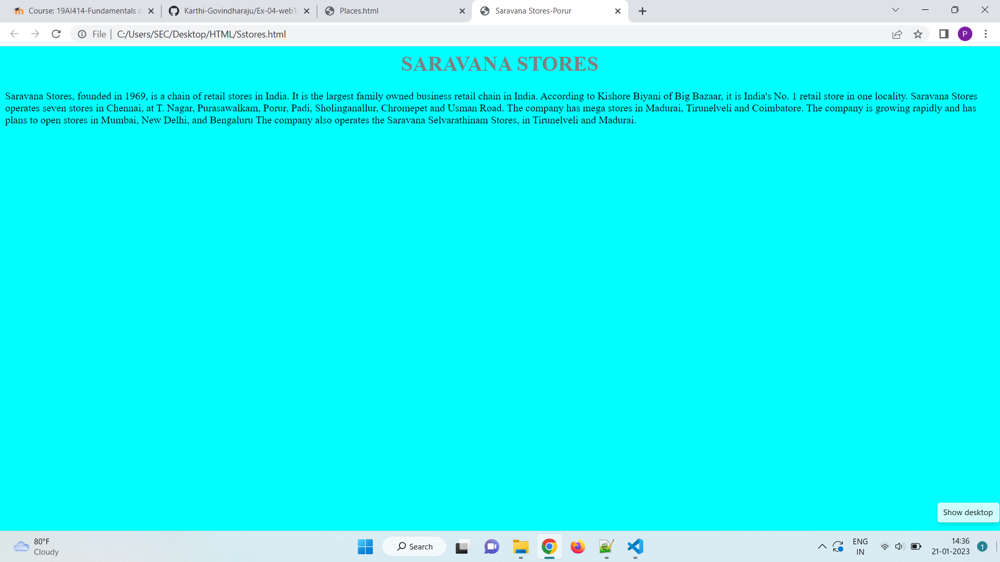

# Places Around Me
# Aim:
To develop a website to display details about the places around my house.

# Design Steps:
## Step 1
Clone the GitHUB repository.
## Step 2
Create a new Django Project.
## Step 3
Write the neede HTML code.

## Step 4
Run the Django project and Execute the HTML files
# Code:
```html
Main.html
<html>
<head>
<title></title>
</head>
<body>

<map name="image-map">
<area target="_blank" alt="" title="DLF" href="DLF.html" coords="552,420,830,507" shape="rect">
<area target="_blank" alt="" title="" href="Miot.html" coords="1167,375,1416,487" shape="rect">
<area target="_blank" alt="" title="" href="Sstores.html" coords="206,6,475,106" shape="rect">
<area target="_blank" alt="" title="" href="Feathers.html" coords="1071,526,842,421" shape="rect">
<area target="_blank" alt="" title="" href="bbqnation.html" coords="439,139,692,234" shape="rect">
</map>
</body>
</html>

DLF.html

<html>
<head>
<title>DLF Cybercity</title>
</head>
<style>
body
{
background-color:cyan
}
h1{
color:gray;
text-align:center;
}
</style>
<body>
<h1>DLF</h1>
Delhi Land & Finance (DLF Limited) is a commercial real estate developer. It was 
founded by Chaudhary Raghvendra Singh in 1946 and it is based in New Delhi, India.
DLF developed residential colonies in Delhi such as, Model Town,Rajouri Garden,
Krishna Nagar,South Extension, Greater Kailash, Kailash Colony, and Hauz Khas. 
DLF builds residential, office, and retail properties.With the passage of Delhi 
Development Act in 1957, the local government assumed control of real estate 
developmentin Delhi and banned private real estate developers.As a result, DLF 
began acquiring land at a relatively low cost outside the area controlled by the 
Delhi Development Authority, in the district of Gurgaon, in the adjacent state of 
Haryana. In the mid-1970s, the company started developing their DLF City project at 
Gurgaon.Its plans included hotels, infrastructure and special economic zones-related 
development projects.
</body>
</body>
</html>

bbqnation.html

<html>
<head>
<title>Barbeque Nation</title>
</head>
<style>
body
{
background-color:cyan
}
h1{
color:gray;
text-align:center;
}
</style>
<h1>BARBEQUE NATION</h1>
<body>
Barbeque Nation was founded in 2006 with a simple vision – offering a complete dining
experience to customers at affordable prices.One of the most successful casual dining 
chains in India, Barbeque Nation pioneered the concept of live grills embedded under 
dining tables – allowing customers to grill their own barbecue’s right at their 
tables.A novelty at the time, the restaurant allowed clients to customize their own
starters with their preference of flavours – ushering the era of ‘Do It Yourself 
cuisine’ in India. The look and feel of all outlets is rustic and casual with wood 
and open-brick wall surface. The sizzle of the grills livens up the whole atmosphere
and gives diners a comfortable and cosy experience.In its very first outlet in Mumbai
in 2006, Barbeque Nation inculcated the one principle that would cause the chain to 
expand pan-India in an amazingly short time period, putting the customer first at all 
steps of the dining experience – from reserving a table and customizing the level of 
spiciness,to creating in house live entertainment and taking feedback from customers 
long after their dining experience was over.
</body>
</body>
</html>

Miot.html

<html>
<head>
<title>Miot International</title>
</head>
<style>
body
{
background-color:cyan
}
h1{
color:gray;
text-align:center;
}
</style>
<body>
<h1>MIOT HOSPITAL</h1>
The Madras Institute of Orthopaedics and Traumatology, known in short as the MIOT 
International Hospital, is a multi-specialty hospital in Manapakkam, Chennai, India.
It is a specialty hospital in the field of joint replacement surgeries, 
Interventional Cardiology, orthopaedics and trauma.Founded by P. V. A. Mohandas,the
hospital was established in February 1999 on a 14-acre (5.7 ha) land with German 
collaboration, with an initial investment of ₹500,000.The hospital has 1000 beds 
and employs 170 physicians.It receives nearly 3,500 foreign patients every year, 
contributing 25 percent of the hospital's patients. North and East Africa account
for many of these foreign patients.
</body>
</html>

Feathers.html

<html>
<head>
<title>Feathers A radha</title>
</head>
<style>
body
{
background-color:cyan
}
h1{
color:gray;
text-align:center;
}
</style>
<h1>FEATHERS</h1>
<body>
Set in a commercial area, this polished hotel is 10 km from Chennai International 
Airport and 6 km from St. Thomas Mount National Shrine.The bright, refined rooms 
feature flat-screen TVs, Wi-Fi, andtea and coffeemaking facilities. Most have 
floor-to ceiling windows. Suites add living rooms. Room service is available 24 
hours.There's a fine-dining restaurant, a rooftop restaurant and an international 
eatery,along with 3 bars and a tearoom.A breakfast buffet is extra. Additional 
amenities include an outdoor pool, a fitness centre and a spa. There's 2,000 sq m 
of event space.
</body>
</html>

Sstores.html

<html>
<head>
<title>Saravana Stores-Porur</title>
</head>
<style>
body
{
background-color:cyan
}
h1{
color:gray;
text-align:center;
}
</style>
<h1>SARAVANA STORES</h1>
<body>
Saravana Stores, founded in 1969, is a chain of retail stores in India.It is the 
largest family owned business retail chain in India.According to Kishore Biyani 
of Big Bazaar, it is India's No. 1 retail store in one locality.Saravana Stores 
operates seven stores in Chennai,at T. Nagar, Purasawalkam, Porur, Padi,Sholinganallur, 
Chromepet and Usman Road.The company has mega stores in Madurai, Tirunelveli and 
Coimbatore.The company is growing rapidly and has plans to open stores in Mumbai,
New Delhi, and Bengaluru The company also operates the Saravana Selvarathinam 
Stores,in Tirunelveli and Madurai.
</body>
</html>
```
# Output:








# Result:
The program for implementing image map is executed.
